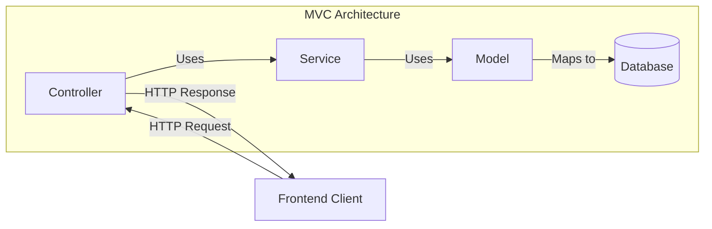
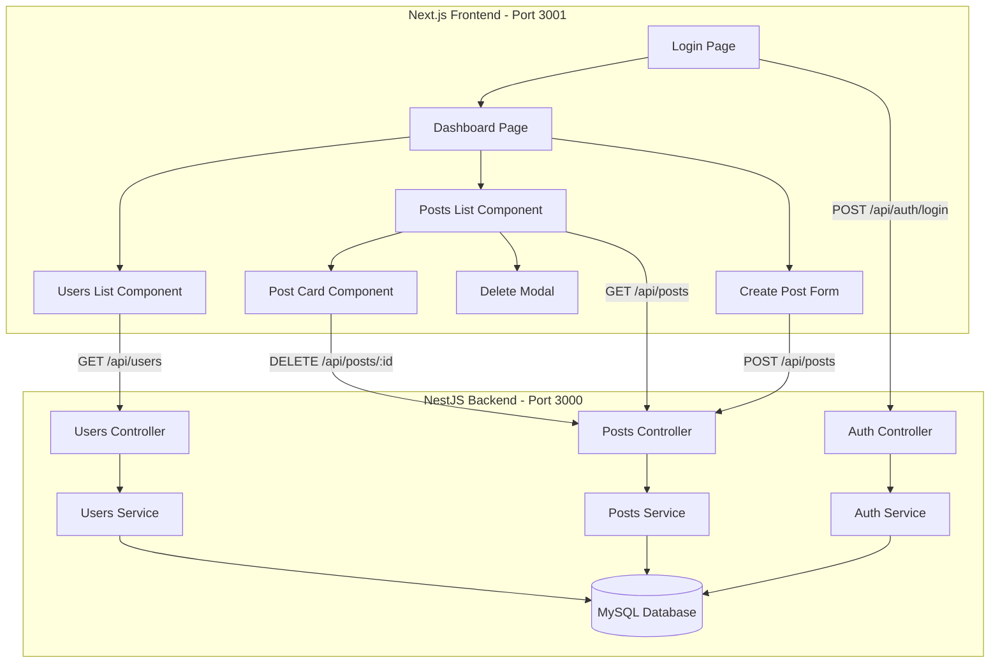

# خطة فصل الـ Frontend إلى Next.js

## نظرة عامة

هذه الخطة تهدف إلى فصل الـ Frontend الحالي (Vanilla HTML/CSS/JS) إلى مشروع Next.js منفصل مع الحفاظ على الـ Backend NestJS MVC كما هو.

## هيكل MVC في Backend

الـ Backend الحالي يتبع نمط **MVC (Model-View-Controller)** بشكل صحيح:



### المكونات:

| المكون | الملفات | المسؤولية |
|--------|---------|-----------|
| **Model** | `src/*/models/*.model.ts` | تعريف هيكل البيانات والعلاقات مع قاعدة البيانات |
| **View** | `public/` → `frontend/` | عرض البيانات للمستخدم - سيتم نقله إلى Next.js |
| **Controller** | `src/*/\*.controller.ts` | استقبال الطلبات وإرجاع الاستجابات |
| **Service** | `src/*/\*.service.ts` | منطق الأعمال ومعالجة البيانات |

### ملفات MVC الحالية:

```
src/
├── users/
│   ├── users.controller.ts    # Controller - معالجة طلبات المستخدمين
│   ├── users.service.ts       # Service - منطق الأعمال
│   ├── models/
│   │   └── user.model.ts      # Model - تعريف جدول المستخدمين
│   └── dto/
│       └── create-user.dto.ts # DTO - التحقق من البيانات
├── posts/
│   ├── posts.controller.ts    # Controller - معالجة طلبات المنشورات
│   ├── posts.service.ts       # Service - منطق الأعمال
│   ├── models/
│   │   └── post.model.ts      # Model - تعريف جدول المنشورات
│   └── dto/
│       └── create-post.dto.ts # DTO - التحقق من البيانات
└── auth/
    ├── auth.controller.ts     # Controller - معالجة طلبات المصادقة
    └── auth.service.ts        # Service - منطق المصادقة
```

> **ملاحظة مهمة**: الـ Backend سيبقى كما هو بنمط MVC. التغيير الوحيد هو إزالة `ServeStaticModule` وإضافة CORS للسماح للـ Frontend المنفصل بالتواصل مع الـ API.

## الهيكل الحالي

```
micro-posting-website/
├── src/                    # NestJS Backend
│   ├── auth/              # Authentication Module
│   ├── posts/             # Posts Module
│   ├── users/             # Users Module
│   └── common/            # Shared utilities
├── public/                # Static Frontend (سيتم استبداله)
│   ├── index.html         # Login page
│   ├── dashboard.html     # Dashboard page
│   ├── css/style.css
│   └── js/
│       ├── api.service.js
│       ├── app.js
│       └── validators.js
└── database/              # Database config & seeders
```

## الهيكل الجديد المقترح

```
micro-posting-website/
├── src/                    # NestJS Backend (بدون تغيير كبير)
├── frontend/              # Next.js Frontend (جديد)
│   ├── src/
│   │   ├── app/           # App Router
│   │   │   ├── layout.tsx
│   │   │   ├── page.tsx   # Login
│   │   │   └── dashboard/
│   │   │       └── page.tsx
│   │   ├── components/    # React Components
│   │   │   ├── LoginForm.tsx
│   │   │   ├── PostCard.tsx
│   │   │   ├── PostForm.tsx
│   │   │   ├── UsersList.tsx
│   │   │   └── DeleteModal.tsx
│   │   ├── services/      # API Services
│   │   │   └── api.service.ts
│   │   ├── hooks/         # Custom Hooks
│   │   │   └── useAuth.ts
│   │   ├── types/         # TypeScript Types
│   │   │   └── index.ts
│   │   └── styles/        # CSS Styles
│   │       └── globals.css
│   ├── package.json
│   ├── next.config.js
│   └── tsconfig.json
├── database/              # Database config
└── public/                # سيتم حذفه أو الاحتفاظ به للتوثيق
```

## مخطط الهيكل الجديد



## API Endpoints المتاحة

| Method | Endpoint | Description | Auth Required |
|--------|----------|-------------|---------------|
| POST | `/api/auth/login` | تسجيل الدخول | ❌ |
| GET | `/api/users` | جلب جميع المستخدمين | ❌ |
| GET | `/api/users/:id` | جلب مستخدم محدد | ❌ |
| POST | `/api/users` | إنشاء مستخدم جديد | ❌ |
| GET | `/api/posts?userId=X` | جلب منشورات مستخدم | ✅ |
| POST | `/api/posts` | إنشاء منشور جديد | ✅ |
| DELETE | `/api/posts/:id` | حذف منشور | ✅ |

## خطوات التنفيذ التفصيلية

### المرحلة 1: تعديل Backend NestJS

#### 1.1 إزالة ServeStaticModule
- تعديل [`src/app.module.ts`](src/app.module.ts) لإزالة `ServeStaticModule`
- إزالة import الخاص بـ `@nestjs/serve-static`

#### 1.2 إضافة CORS
- تعديل [`src/main.ts`](src/main.ts) لإضافة `app.enableCors()` للسماح بالطلبات من Frontend

### المرحلة 2: إنشاء مشروع Next.js

#### 2.1 إنشاء المشروع
```bash
npx create-next-app@latest frontend --typescript --tailwind --eslint --app --src-dir
```

#### 2.2 هيكل المجلدات
```
frontend/
├── src/
│   ├── app/
│   │   ├── layout.tsx          # Root layout
│   │   ├── page.tsx            # Login page
│   │   ├── globals.css         # Global styles
│   │   └── dashboard/
│   │       └── page.tsx        # Dashboard page
│   ├── components/
│   │   ├── LoginForm.tsx
│   │   ├── PostCard.tsx
│   │   ├── PostForm.tsx
│   │   ├── UsersList.tsx
│   │   └── DeleteModal.tsx
│   ├── services/
│   │   └── api.service.ts
│   ├── hooks/
│   │   └── useAuth.ts
│   └── types/
│       └── index.ts
├── .env.local
├── next.config.js
├── package.json
└── tsconfig.json
```

### المرحلة 3: إنشاء الـ Types

```typescript
// types/index.ts
export interface User {
  id: number;
  name: string;
  email: string;
  createdAt: string;
  updatedAt: string;
}

export interface Post {
  id: number;
  content: string;
  userId: number;
  createdAt: string;
  updatedAt: string;
}

export interface LoginResponse {
  access_token: string;
  user: User;
}

export interface ApiResponse<T> {
  success: boolean;
  data: T;
  message?: string;
}
```

### المرحلة 4: إنشاء API Service

```typescript
// services/api.service.ts
const API_URL = process.env.NEXT_PUBLIC_API_URL || 'http://localhost:3000/api';

class ApiService {
  // ... implementation
}
```

### المرحلة 5: إنشاء الصفحات والمكونات

#### 5.1 صفحة تسجيل الدخول
- نقل منطق [`public/index.html`](public/index.html) إلى `frontend/src/app/page.tsx`
- استخدام React hooks للـ state management

#### 5.2 صفحة Dashboard
- نقل منطق [`public/dashboard.html`](public/dashboard.html) و [`public/js/app.js`](public/js/app.js)
- تقسيم إلى components منفصلة

#### 5.3 المكونات
- `LoginForm`: نموذج تسجيل الدخول
- `UsersList`: قائمة المستخدمين
- `PostCard`: بطاقة المنشور
- `PostForm`: نموذج إنشاء منشور
- `DeleteModal`: نافذة تأكيد الحذف

### المرحلة 6: نظام المصادقة

```typescript
// hooks/useAuth.ts
export function useAuth() {
  // Check token validity
  // Redirect if not authenticated
  // Provide logout function
}
```

### المرحلة 7: الـ Styles

- نقل الـ CSS من [`public/css/style.css`](public/css/style.css) إلى `frontend/src/app/globals.css`
- تحويل إلى CSS Modules أو Tailwind CSS حسب الحاجة

## ملفات التكوين

### Backend .env
```env
# Database
DB_HOST=localhost
DB_PORT=3306
DB_USERNAME=root
DB_PASSWORD=root
DB_DATABASE=micro_posting

# JWT
JWT_SECRET=your-secret-key

# Server
PORT=3000
```

### Frontend .env.local
```env
NEXT_PUBLIC_API_URL=http://localhost:3000/api
```

## تشغيل المشروع

### Backend
```bash
# من المجلد الرئيسي
npm run start:dev
# يعمل على http://localhost:3000
```

### Frontend
```bash
# من مجلد frontend
cd frontend
npm run dev
# يعمل على http://localhost:3001
```

## ملاحظات مهمة

1. **CORS**: يجب تفعيل CORS في Backend للسماح بالطلبات من `http://localhost:3001`
2. **Environment Variables**: استخدام `NEXT_PUBLIC_` prefix للمتغيرات المستخدمة في Client-side
3. **Authentication**: تخزين الـ token في `localStorage` (كما هو حالياً)
4. **API Prefix**: جميع الـ endpoints تبدأ بـ `/api`

## الملفات التي ستتأثر

### ملفات سيتم تعديلها:
- [`src/app.module.ts`](src/app.module.ts) - إزالة ServeStaticModule
- [`src/main.ts`](src/main.ts) - إضافة CORS
- [`package.json`](package.json) - إضافة scripts جديدة (اختياري)

### ملفات جديدة (في frontend/):
- `package.json`
- `next.config.js`
- `tsconfig.json`
- `.env.local`
- `src/app/layout.tsx`
- `src/app/page.tsx`
- `src/app/globals.css`
- `src/app/dashboard/page.tsx`
- `src/components/*.tsx`
- `src/services/api.service.ts`
- `src/hooks/useAuth.ts`
- `src/types/index.ts`

### ملفات يمكن حذفها (اختياري):
- `public/` - المجلد بالكامل (أو الاحتفاظ به للمرجعية)

---

## الممارسات الفضلى للكود النظيف والهيكلية النظيفة

### 1. مبادئ Clean Code

#### 1.1 تسمية واضحة ومعبرة
```typescript
// ❌ سيء
const d = new Date();
const u = await getU();

// ✅ جيد
const currentDate = new Date();
const currentUser = await getCurrentUser();
```

#### 1.2 دوال صغيرة ومركزة - Single Responsibility
```typescript
// ❌ سيء - دالة تفعل أشياء كثيرة
async function handleLogin(email: string, password: string) {
  // validate
  // call API
  // store token
  // redirect
  // show notification
}

// ✅ جيد - دوال منفصلة لكل مسؤولية
async function validateCredentials(email: string, password: string): boolean { }
async function authenticateUser(credentials: LoginCredentials): AuthResponse { }
function storeAuthToken(token: string): void { }
function redirectToDashboard(): void { }
```

#### 1.3 تجنب التكرار - DRY Principle
```typescript
// ❌ سيء - تكرار الكود
const userResponse = await fetch('/api/users', { headers: getHeaders() });
const postsResponse = await fetch('/api/posts', { headers: getHeaders() });

// ✅ جيد - استخدام دالة مشتركة
const userResponse = await apiClient.get('/users');
const postsResponse = await apiClient.get('/posts');
```

### 2. هيكلية المجلدات - Clean Architecture

```
frontend/src/
├── app/                    # Next.js App Router - Entry Points فقط
│   ├── layout.tsx
│   ├── page.tsx
│   └── dashboard/
│       └── page.tsx
│
├── components/             # UI Components - العرض فقط
│   ├── ui/                # Reusable UI components
│   │   ├── Button.tsx
│   │   ├── Input.tsx
│   │   ├── Modal.tsx
│   │   └── Card.tsx
│   ├── forms/             # Form components
│   │   ├── LoginForm.tsx
│   │   └── PostForm.tsx
│   └── features/          # Feature-specific components
│       ├── posts/
│       │   ├── PostCard.tsx
│       │   └── PostsList.tsx
│       └── users/
│           └── UsersList.tsx
│
├── services/              # Business Logic & API calls
│   ├── api/
│   │   ├── client.ts      # HTTP client configuration
│   │   ├── auth.service.ts
│   │   ├── posts.service.ts
│   │   └── users.service.ts
│   └── storage/
│       └── token.service.ts
│
├── hooks/                 # Custom React Hooks
│   ├── useAuth.ts
│   ├── usePosts.ts
│   └── useUsers.ts
│
├── types/                 # TypeScript Types & Interfaces
│   ├── auth.types.ts
│   ├── post.types.ts
│   ├── user.types.ts
│   └── api.types.ts
│
├── utils/                 # Utility functions
│   ├── validators.ts
│   ├── formatters.ts
│   └── constants.ts
│
└── styles/               # Global styles
    └── globals.css
```

### 3. فصل المسؤوليات - Separation of Concerns

#### 3.1 طبقة العرض - Presentation Layer
```typescript
// components/features/posts/PostCard.tsx
// المسؤولية: عرض البيانات فقط - لا business logic

interface PostCardProps {
  post: Post;
  onDelete: (id: number) => void;
  isOwner: boolean;
}

export function PostCard({ post, onDelete, isOwner }: PostCardProps) {
  return (
    <div className="post-card">
      <p>{post.content}</p>
      <span>{formatTimeAgo(post.createdAt)}</span>
      {isOwner && (
        <button onClick={() => onDelete(post.id)}>Delete</button>
      )}
    </div>
  );
}
```

#### 3.2 طبقة الخدمات - Service Layer
```typescript
// services/api/posts.service.ts
// المسؤولية: التعامل مع API فقط

import { apiClient } from './client';
import type { Post, CreatePostDto, ApiResponse } from '@/types';

export const postsService = {
  async getByUserId(userId: number): Promise<Post[]> {
    const response = await apiClient.get<ApiResponse<Post[]>>(
      `/posts?userId=${userId}`
    );
    return response.data;
  },

  async create(data: CreatePostDto): Promise<Post> {
    const response = await apiClient.post<ApiResponse<Post>>('/posts', data);
    return response.data;
  },

  async delete(id: number): Promise<void> {
    await apiClient.delete(`/posts/${id}`);
  },
};
```

#### 3.3 طبقة الـ Hooks - State Management Layer
```typescript
// hooks/usePosts.ts
// المسؤولية: إدارة الحالة والتنسيق بين الطبقات

import { useState, useCallback } from 'react';
import { postsService } from '@/services/api/posts.service';
import type { Post } from '@/types';

export function usePosts(userId: number) {
  const [posts, setPosts] = useState<Post[]>([]);
  const [loading, setLoading] = useState(false);
  const [error, setError] = useState<string | null>(null);

  const fetchPosts = useCallback(async () => {
    setLoading(true);
    setError(null);
    try {
      const data = await postsService.getByUserId(userId);
      setPosts(data);
    } catch (err) {
      setError(err instanceof Error ? err.message : 'Failed to fetch posts');
    } finally {
      setLoading(false);
    }
  }, [userId]);

  const deletePost = useCallback(async (id: number) => {
    try {
      await postsService.delete(id);
      setPosts(prev => prev.filter(p => p.id !== id));
    } catch (err) {
      setError(err instanceof Error ? err.message : 'Failed to delete post');
    }
  }, []);

  return { posts, loading, error, fetchPosts, deletePost };
}
```

### 4. معالجة الأخطاء - Error Handling

#### 4.1 أنواع الأخطاء المخصصة
```typescript
// types/errors.ts
export class ApiError extends Error {
  constructor(
    message: string,
    public statusCode: number,
    public code?: string
  ) {
    super(message);
    this.name = 'ApiError';
  }
}

export class AuthenticationError extends ApiError {
  constructor(message = 'Authentication failed') {
    super(message, 401, 'AUTH_ERROR');
    this.name = 'AuthenticationError';
  }
}
```

#### 4.2 معالجة مركزية للأخطاء
```typescript
// services/api/client.ts
async function handleResponse<T>(response: Response): Promise<T> {
  if (!response.ok) {
    if (response.status === 401) {
      tokenService.clear();
      throw new AuthenticationError();
    }
    
    const error = await response.json();
    throw new ApiError(
      error.message || 'Something went wrong',
      response.status
    );
  }
  
  return response.json();
}
```

### 5. Type Safety

#### 5.1 تعريف الأنواع بشكل صحيح
```typescript
// types/user.types.ts
export interface User {
  id: number;
  name: string;
  email: string;
  createdAt: string;
  updatedAt: string;
}

// types/post.types.ts
export interface Post {
  id: number;
  content: string;
  userId: number;
  user?: User;
  createdAt: string;
  updatedAt: string;
}

export interface CreatePostDto {
  content: string;
}

// types/api.types.ts
export interface ApiResponse<T> {
  success: boolean;
  data: T;
  message?: string;
}

export interface PaginatedResponse<T> extends ApiResponse<T> {
  meta: {
    total: number;
    page: number;
    limit: number;
  };
}
```

### 6. Environment Variables

```typescript
// utils/constants.ts
export const config = {
  apiUrl: process.env.NEXT_PUBLIC_API_URL || 'http://localhost:3000/api',
  appName: 'Micro-Posting',
} as const;

// استخدام Type-safe environment variables
declare global {
  namespace NodeJS {
    interface ProcessEnv {
      NEXT_PUBLIC_API_URL: string;
    }
  }
}
```

### 7. مبادئ SOLID

#### 7.1 Single Responsibility Principle
كل ملف/كلاس/دالة لها مسؤولية واحدة فقط.

#### 7.2 Open/Closed Principle
```typescript
// يمكن توسيع الـ API client بدون تعديله
const apiClient = createApiClient({
  baseUrl: config.apiUrl,
  interceptors: [authInterceptor, loggingInterceptor],
});
```

#### 7.3 Interface Segregation
```typescript
// واجهات صغيرة ومحددة
interface Deletable {
  delete(id: number): Promise<void>;
}

interface Fetchable<T> {
  fetch(): Promise<T[]>;
}

interface PostsService extends Deletable, Fetchable<Post> {
  create(data: CreatePostDto): Promise<Post>;
}
```

### 8. Testing Structure

```
frontend/
├── __tests__/
│   ├── components/
│   │   └── PostCard.test.tsx
│   ├── hooks/
│   │   └── usePosts.test.ts
│   └── services/
│       └── posts.service.test.ts
├── __mocks__/
│   └── api.ts
└── jest.config.js
```

### 9. ملخص الممارسات الفضلى

| المبدأ | الوصف |
|--------|-------|
| **SRP** | كل وحدة لها مسؤولية واحدة |
| **DRY** | لا تكرار للكود |
| **KISS** | البساطة في التصميم |
| **Separation of Concerns** | فصل العرض عن المنطق عن البيانات |
| **Type Safety** | استخدام TypeScript بشكل صحيح |
| **Error Handling** | معالجة مركزية للأخطاء |
| **Testability** | كود قابل للاختبار |
